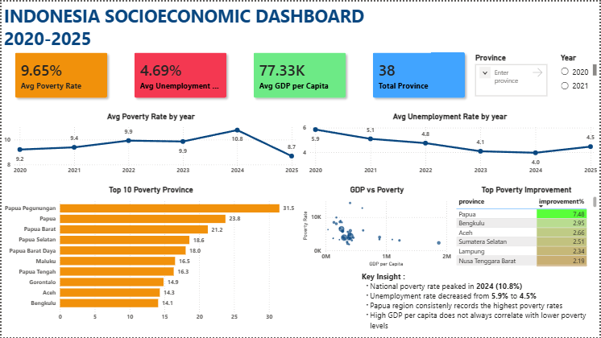

# Indonesia Socioeconomic Dashboard (2020–2025)

## Overview

This project analyzes socioeconomic conditions across Indonesian provinces between 2020 and 2025 using official public data. The analysis focuses on poverty, unemployment, population, and GDP per capita to identify regional disparities and long-term development trends.

---

## Dashboard Preview



---

## Objectives

* Analyze poverty trends across Indonesia.
* Analyze unemployment trends across provinces.
* Compare regional socioeconomic performance.
* Explore the relationship between GDP per capita and poverty.
* Measure poverty improvement between 2020 and 2025.

---

## Tools & Technologies

* MySQL
* Power BI
* Microsoft Excel

---

## Project Structure

```text
indonesia_socioeconomic_dashboard/
│
├── dataset/
├── documentation/
├── powerbi/
├── screenshots/
└── sql/
```

---

## Key Insights

* Poverty peaked nationally in 2024 before declining in 2025.
* Unemployment decreased steadily throughout the analysis period.
* Papua region consistently showed the highest poverty rates.
* GDP growth alone does not guarantee lower poverty levels.
* Papua achieved the largest poverty reduction from 2020 to 2025.

---

## Skills Demonstrated

* Data Cleaning
* Exploratory Data Analysis
* Business Analysis
* SQL Query Development
* Power BI Dashboard Development

---

## Repository Contents

| Folder        | Description                           |
| ------------- | ------------------------------------- |
| dataset       | Source and cleaned datasets           |
| sql           | SQL scripts for cleaning and analysis |
| powerbi       | Power BI dashboard file               |
| screenshots   | Dashboard screenshots                 |
| documentation | Business insights and project summary |

---

## Author

Dwi Ari Poetanto

Aspiring Data Analyst focused on SQL, Power BI, and Business Intelligence.
